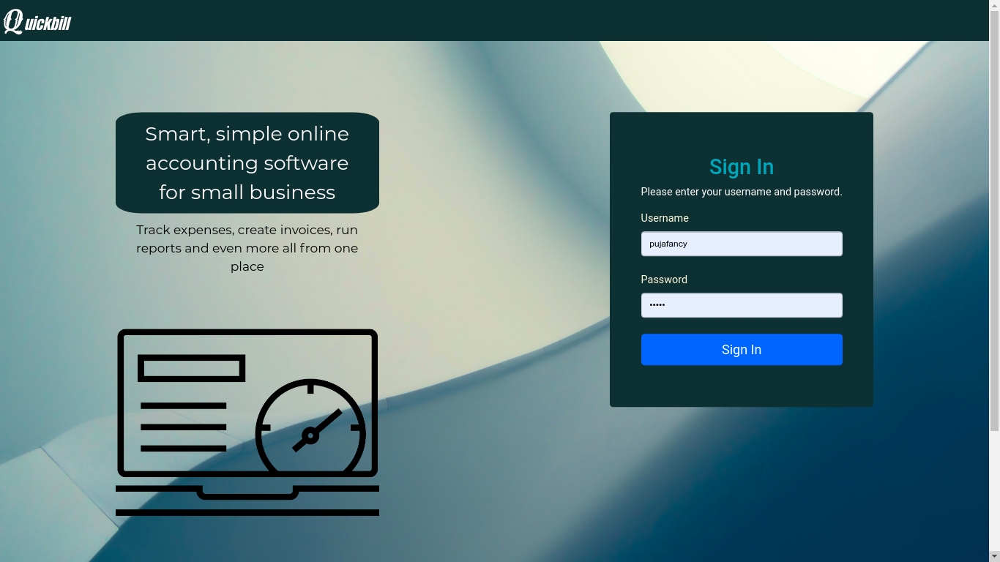
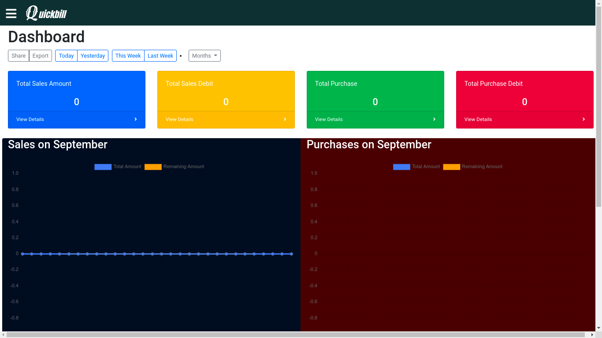
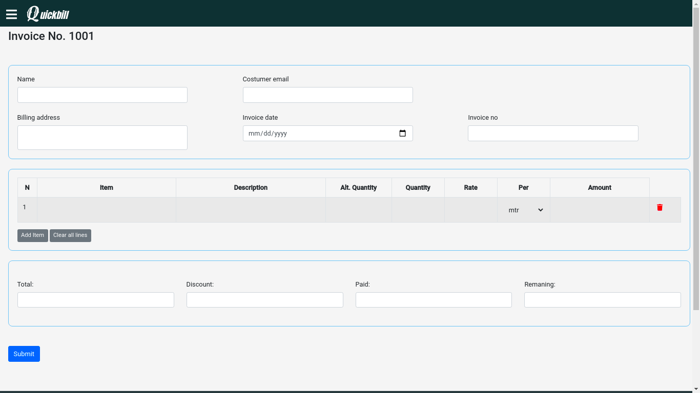

# Quickbill
[](https://coveralls.io/github/Aadesh-Baral/Quickbill?branch=master)

Store management web based application developed to address need of clothing store but can be customized to use for any store billing and inventory management 


## Acknowledgements

 - [Bootstrap](https://getbootstrap.com/)
 - [DataTables](https://datatables.net/)
 - [mmenu.js](https://mmenujs.com/)

  
## Overview




## Demo
[Demo Link](https://fastinvoice.herokuapp.com/)

## Features

- Dashboard
- Sales/Purchase Entry
- Client Profile Management
- Generate Invoice

  
## Run Locally

Clone the project

```bash
  git clone https://github.com/Aadesh-Baral/Quickbill.git

```

Go to the project directory

```bash
  cd Quickbill
```
Create virtual environment
```bash
  python3 -m venv
```
Activate virtual environment
```bash
  source venv/bin/activate
```
Install dependencies

```bash
  pip install -r requirements.txt
```

Start the server

```bash
  python app.py
```

    
